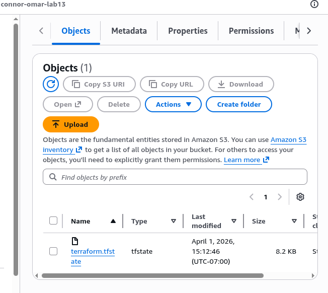
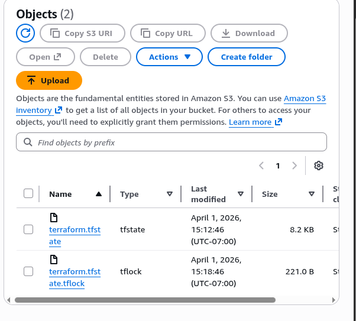

# terraform-s3-backend-lab

Q: When is the state file created?
A: Local created on terraform init. Once applied creates one on the S3 bucket after confirming with 'yes'.

Q: When is the lock file present?
A: Local created on terraform init. On S3 bucket After terraform apply, before entering 'yes'

Q: Is the lock file always in the bucket after it is created?
A: No, it only appears between apply and confirming with 'yes'.

